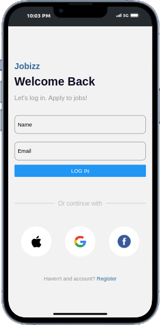

# DCIT202 Mobile Application Development Assignment 4

## Project Description

This project involves developing a mobile application that mimics a UI mockup, implements a login functionality, and displays job cards for both popular and featured job listings. The application uses various React Native core components and custom components to achieve the desired functionality and design.

## Objectives

1. **Recreate the UI design** as provided in the mockup.
2. **Implement a login screen** that passes the user's name and email to the home screen upon login.
3. **Display the user's name and email** on the home screen.
4. **Create functional components** for job cards that accept card details as props.
5. **Display at least 8 different job cards** in both the popular and featured job sections.
6. **Style the application** to closely match the provided UI design.
7. **Use custom components** throughout the application.

## Core Components Used

- **View**: For container components and layout.
- **Text**: For displaying text.
- **TextInput**: For accepting user input.
- **Button**: For triggering actions.
- **StyleSheet**: For creating and managing styles.
- **ScrollView**: For creating scrollable containers.
- **FlatList**: For efficiently rendering lists of items.
- **Image**: For displaying images.

## Custom Components

- **JobCard**: A functional component for rendering job cards. It accepts job details as props and displays them.

## Implementation

### 1. Recreate UI Design

The UI design is recreated using React Native components and custom styles to match the provided mockup as closely as possible.

### 2. Login Screen

The login screen contains two `TextInput` fields for the user's name and email, and a `Button` to submit the form. Upon clicking the login button, the app navigates to the home screen and passes the entered name and email as parameters.

### 3. Home Screen

The home screen retrieves the name and email from the navigation parameters and displays them using `Text` components. It also includes sections for popular and featured job cards.

### 4. Job Cards

The `JobCard` component is designed to accept job details as props. Two lists of job cards are displayed: one for popular jobs and another for featured jobs, each containing at least 8 different cards.

### 5. Styling

The application is styled using React Native's `StyleSheet` to closely match the provided UI design.

## Installation

### Prerequisites

- Node.js
- npm or yarn
- React Native CLI

### Setup

1. Clone the repository to your local machine:

    ```bash
    git clone <repository-url>
    cd rn-assignment4-ID
    ```

2. Install the dependencies:

    ```bash
    npm install
    # or
    yarn install
    ```

3. Start the application:

    ```bash
    npm start
    # or
    yarn start
    ```

### Folder Structure

```plaintext
rn-assignment4-ID/
├── App.js
├── components/
│   ├── JobCard.js
│   └── ...
├── screens/
│   ├── LoginScreen.js
│   ├── HomeScreen.js
│   └── ...
├── assets/
│   ├── jobIcons/
│   │   ├── exercise.png
│   │   ├── study.png
│   │   └── ...
│  
├── screenshots/
│   ├── login-screen.png
│   ├── home-screen.png
│   ├── popular-jobs.png
│   └── featured-jobs.png
├── README.md
└── package.json


### Usage
- To use this application, run the following commands:
```
npm start
# or
yarn start

```

### Screenshots

### Login Screen



### Home Screen
